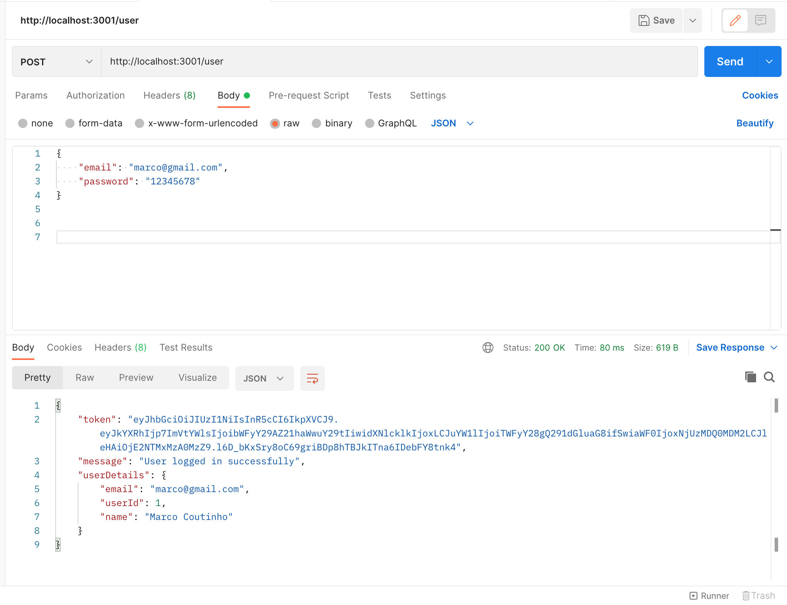
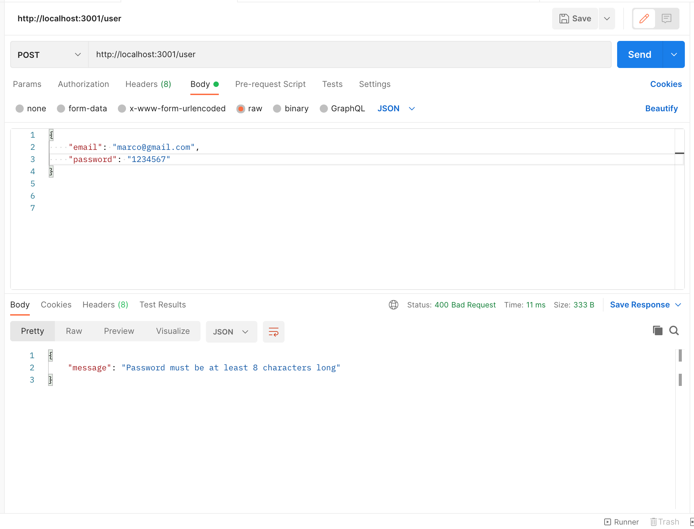
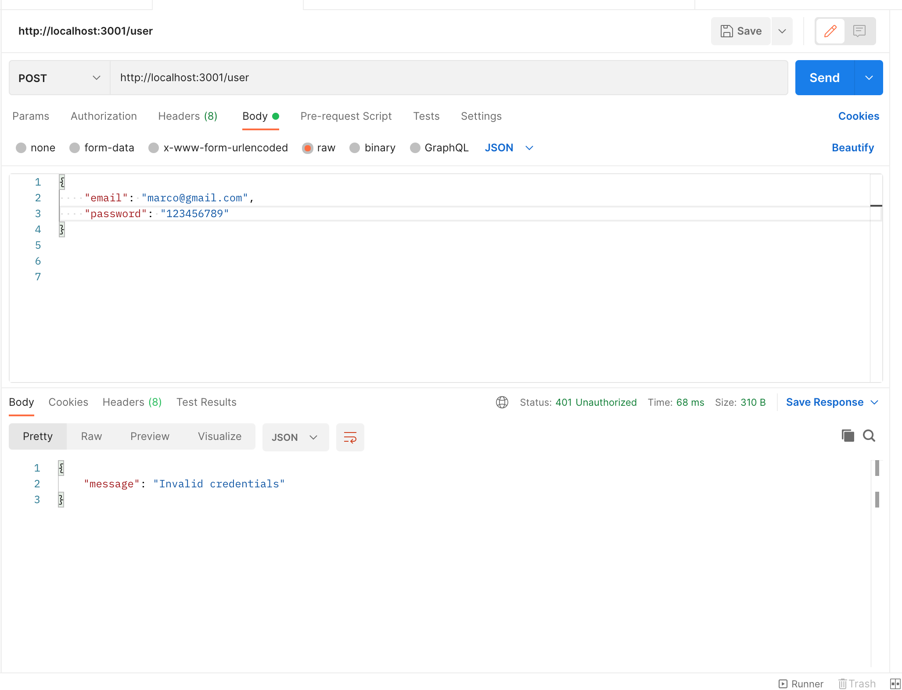
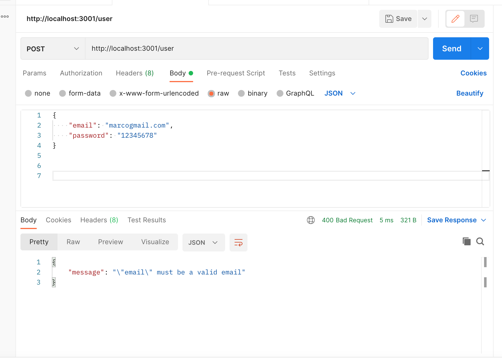

# Back end

<h2>Tecnologias utilizadas:</h2>
<ul>
    <li>Node</li>
    <li>Express</li>
    <li>JsonWebToken</li>
    <li>React Router Dom</li>
    <li>mysql2</li>
    <li>nodemon</li>
    <li>sequelize</li>
    <li>sequelize-cli</li>
    <li>dotenv</li>

</ul>
<hr>


```bash
# Acesse a pasta do projeto no seu terminal/cmd
$ cd agenda
$ cd server
# Instale as dependências
$ npm install

Renomeie o arquivo .env.example para .env e mude para suas variáveis locais

# Para criar o banco de dados com seus dados iniciais
$ npm run create
# Caso queria apagar o banco para começar de novo basta executar
$ npm run drop

# Execute a aplicação em modo de desenvolvimento
$ npm run dev

```

<h1>Endpoints:</h1>

<h2>Login</h2>
Login realizado com sucesso

Senha menor que 8 caracteres

Senha incorreta

Email invalido


